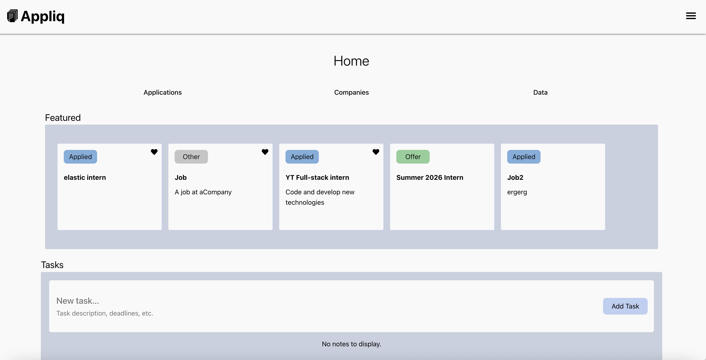
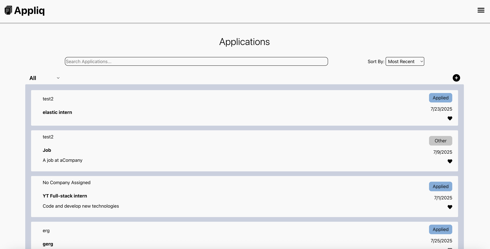
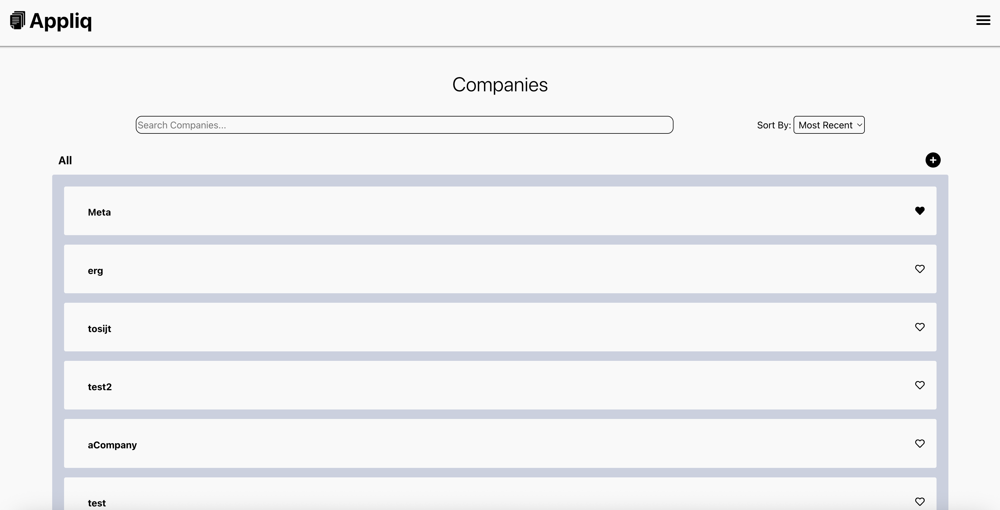
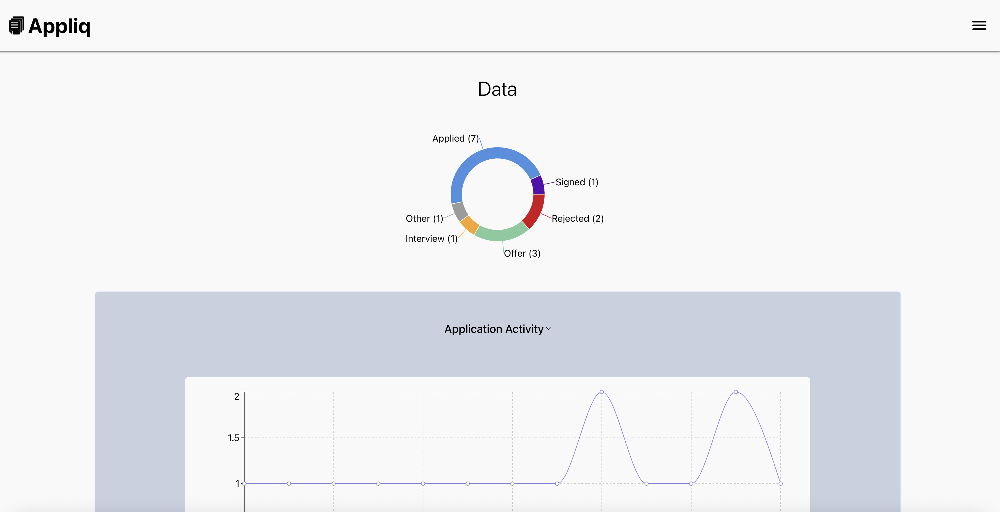
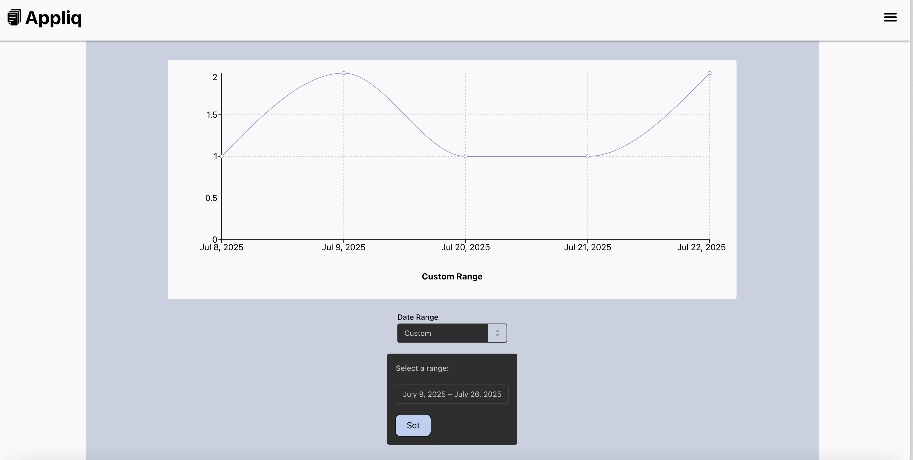
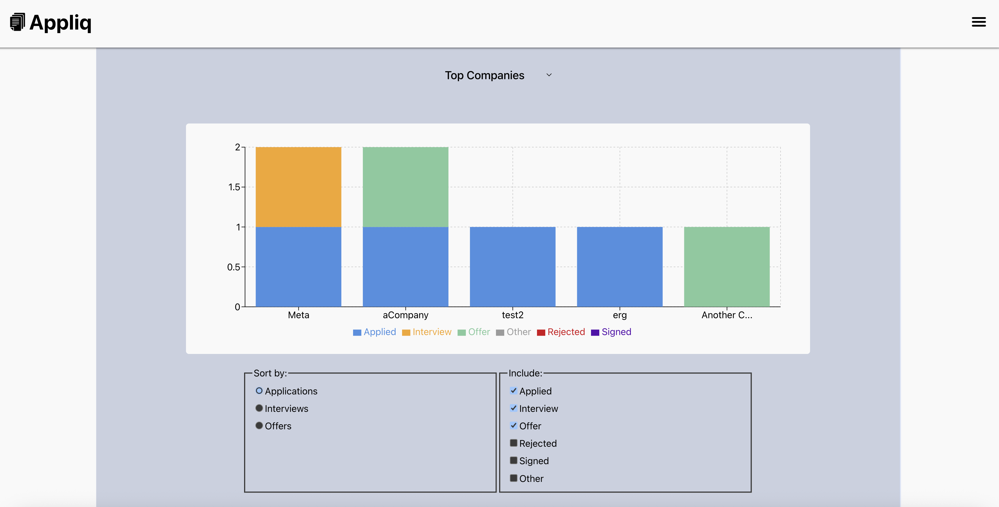

# Applic | Application Tracker

## Feature Overview
Welcome to Appliq! This is a job application tracker with many features to help streamline the application cycle. Check out the sections below to see more detail on features and the codebase!

## User Features
### Authentication
- Google OAuth support
- Standard username/password authentication with bcrypt encryption
- User authentication stored in the database using Express Session and Prisma Session Store, allowing for persisting login for 1 hour
### Home Page
- View a featured list of favorite applications and upcoming interviews. If less than 5 applications match these requirements, recent applications are displayed
- Manage upcoming tasks, such as applications to apply to, deadline, and follow-ups, with a task list

### Application Management
- Add and remove job applications to track current status
- Automatic company linking based on company name
- Modify application details and status, including interview dates, application age, and notes
- Favorite companies to pin to top of list and feature page

### Company Access
- View a dedicated page listing companies for quick access to frequently visited career pages

### Sorting and Filtering
- Sort applications by tags, interview date, and application date for prioritization and search
- Organize applications into different groups and filter views by tags to manage visibility
### Interview Integration
- Automatic loading of interview dates from email using Google Cloud Scheduler (daily and on login)
- Add interviews as events to an Interview subcalendar
### Search Functionality
- Search applications by matching text in any string field, with results ordered by relevance to the title
### Data Dashboard
View statistical diagrams summarizing application statuses for cycle assessment

Data Dashboard

Application activity chart with a custom date range set

Top company chart with default filters and sorting

## Additional Features
### ElasticSearch
- Applications are indexed in ElasticSearch
- Searching for applications uses the elastic search API for efficient and flexible retrieval

### Chron Jobs
- Email scanning is run once daily using Google Cloud Scheduler
- Endpoint is protected using OIDC authentication
- Logs any failures for future assessment
